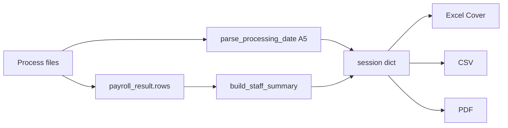

# Day Report cover page update

## What we're changing

Replace the current row-based cover summary in [`weekly/export_service.py`](weekly/export_service.py) with boss-format analysis, plus:

1. **Rename** export report title: `Daily report` → **`Day Report`** (exports only; nav/UI labels unchanged).
2. **Processing date** from employee hours file **cell A5** (e.g. `6/29/2026` → display `29.06.2026`).
3. **Footer metadata** at bottom of cover sheet (and equivalent lines in CSV/PDF).

### Cover layout (top → bottom)

```
┌──────────────────────────────────────────────┐
│ Gazebo HR  (blue header, logo)               │
├──────────────────────────────────────────────┤
│ ░ Data Processing for date:  29.06.2026    ░ │  ← from employee file A5
│ ░ Total staff count          146           ░ │  count only if they have worked
│ ░ Agency staff               59            ░ │
│ ░ Gazebo staff               81            ░ │
│ ░ Gazebo staff on Paid hol.  6             ░ │
│ ░ Total paid hours           1191.38       ░ │
├──────────────────────────────────────────────┤
│   Report metadata                            │
│   Report name:    Day Report                 │
│   Generated at:   09 July 2026, 19:32        │
│   Operator:       HR                         │
└──────────────────────────────────────────────┘
```

**Scope (confirmed):** Excel cover + CSV + PDF. On-screen toolbar unchanged.

## Processing date from A5

ClockRite employee file structure (verified on sample data):

| Row | Col A |
|-----|-------|
| A1 | Paid Hours (Inc Absence) Summary |
| A3 | Company: Gazebo Fine Foods |
| **A5** | **`2026-06-29`** (the day being processed) |
| A6 | header row (Pay ID, Sage, …) |

Add `parse_processing_date(file_obj) -> str | None` in [`weekly/payroll_service.py`](weekly/payroll_service.py):

- Reuse `_load_sheet` (already used by `parse_employee_hours`).
- Read row index 4, column 0 (Excel A5).
- Parse flexibly: `datetime`, `YYYY-MM-DD`, `M/D/YYYY`, Excel date strings.
- Return formatted **`DD.MM.YYYY`** (e.g. `29.06.2026`) or `None` if missing/unparseable.

Call once in `daily_report` POST (before/after `parse_employee_hours`; `file_obj.seek(0)` between reads). Store in session:

```python
request.session['daily_last_result'] = {
    'rows': ...,
    'summary': build_staff_summary(payroll_result.rows),
    'processing_date': parse_processing_date(employee_file),  # '29.06.2026'
    'operator': 'HR',  # ponytail: hardcoded for now
    ...
}
```

Download views pass `processing_date` and `operator` into export helpers (via extended `summary` dict or explicit kwargs — prefer merging into `summary` to keep signatures small).

## Staff counting logic

Add `build_staff_summary(rows) -> dict` next to `split_emp_agency_rows` (~12 lines):

```python
def build_staff_summary(rows: list[dict[str, Any]]) -> dict[str, Any]:
    gazebo, agency = split_emp_agency_rows(rows)
    work_h = lambda r: float(r.get("BasicHours",0) or 0) + float(r.get("MonFriOvertime",0) or 0) + float(r.get("SatSunOvertime",0) or 0)
    paid = lambda r: float(r.get("TotalPaidHours",0) or 0) > 0
    agency_staff = sum(1 for r in agency if paid(r))
    gazebo_paid_holiday = sum(1 for r in gazebo if paid(r) and float(r.get("AnnualHoliday",0) or 0) > 0 and work_h(r) == 0)
    gazebo_staff = sum(1 for r in gazebo if work_h(r) > 0)
    return {
        "total_staff": agency_staff + gazebo_staff + gazebo_paid_holiday,
        "agency_staff": agency_staff,
        "gazebo_staff": gazebo_staff,
        "gazebo_paid_holiday": gazebo_paid_holiday,
        "total_paid_hours": total_paid_hours_from_rows(rows),
    }
```

**Validation:** sample file [`data/day_report_data/dgross_paysummary2 (5).xls`](data/day_report_data/dgross_paysummary2%20(5).xls) → A5 = `29.06.2026`, staff `146/59/81/6`, hours `1191.38`.

## Data flow



## File changes

### 1. [`weekly/payroll_service.py`](weekly/payroll_service.py)
- `parse_processing_date(file_obj) -> str | None`
- `build_staff_summary(rows) -> dict`

### 2. [`weekly/views.py`](weekly/views.py)
- `daily_report` POST: extract `processing_date`, set `operator: 'HR'`, use `build_staff_summary`.
- `download_daily_*`: merge `processing_date`, `operator` from session into summary; recompute staff counts from `rows`.
- Weekly paths unchanged (still "Weekly report"; no A5 date unless requested later).

### 3. [`weekly/export_service.py`](weekly/export_service.py)
- Default `report_title`: **`"Day Report"`** (daily paths only; weekly keeps `"Weekly report"`).
- `_staff_summary_rows(summary)` — one helper for labels used by cover, CSV, PDF.
- **`add_branding_cover_sheet`**:
  - Grey stats block (`#D9D9D9`, thin border).
  - First stats row: `Data Processing for date:` + value (skip row if date missing).
  - Footnote on Total staff count row.
  - **Footer section** below stats: "Report metadata" heading + Report name / Generated at / Operator.
- **`build_csv_bytes`**: processing date line + staff stats + metadata footer rows.
- **`build_pdf_bytes`**: same info in header/footer paragraphs.

### 4. [`weekly/test_payroll_contract.py`](weekly/test_payroll_contract.py)
- `test_parse_processing_date_from_sample_file` → `29.06.2026` from day_report_data file.
- `test_build_staff_summary_additive_counts` on small fixture.

## Operator (future)

Hardcode **`HR`** now. Later: `request.user.get_full_name() or request.user.username` in download views — one-line swap, no export_service change.

## What we skip (ponytail)

- Renaming nav links / page headings ("Daily report" in sidebar) — exports only.
- Weekly report A5 date — not requested.
- On-screen toolbar relabel.
- New workbook sheet — cover page is enough.

## How to verify

1. Process daily files (`dgross_paysummary2 (5).xls` + contract file).
2. Download Excel → Cover shows `Data Processing for date: 29.06.2026`, staff stats, footer metadata with `Day Report` / `Operator: HR`.
3. CSV/PDF → same date, stats, metadata.
4. `python manage.py test weekly.test_payroll_contract`.
