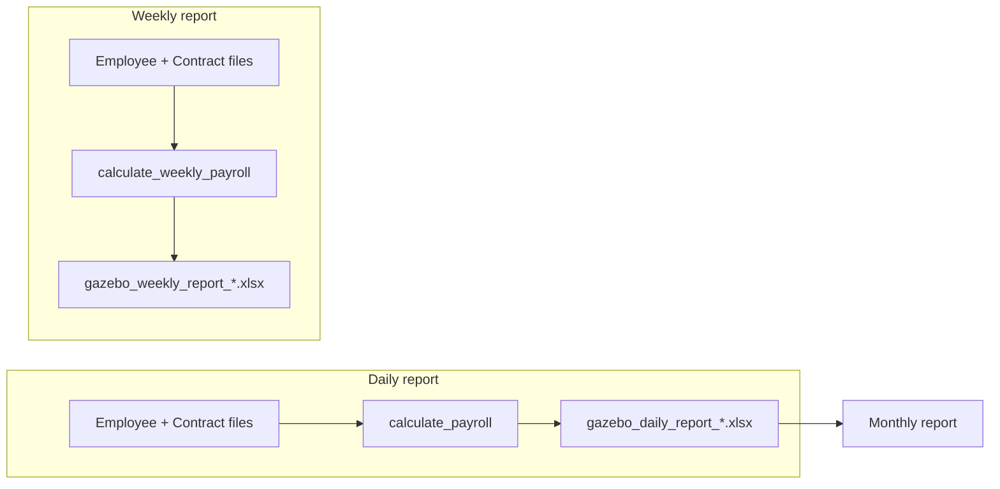

# Daily report rename + new Weekly report

## Phased delivery

Work is split into **4 phases**. Each phase is built and reviewed before the next starts.

| Phase | Scope | Builds on |
|-------|--------|-----------|
| **1** | Rename current report → **Daily report** (rename only, same logic) | — |
| **2** | **Weekly calculation** in `payroll_service.py` | Phase 1 |
| **3** | **Weekly report UI** (page, template, exports, nav) | Phase 2 |
| **4** | **Tests** for weekly calc + daily regression | Phase 3 |

**Approval gate:** Say **"approve phase 1"** (or similar) to implement Phase 1 only. Repeat for each phase.

---

## Phase 1 — Rename to Daily report (rename only)

**Goal:** Everything that is today’s “Weekly report” becomes “Daily report”. No new weekly page yet. Calculation unchanged.

### Backend

[`weekly/views.py`](weekly/views.py), [`weekly/urls.py`](weekly/urls.py):

| Current | Phase 1 target |
|---------|----------------|
| `weekly_report` | `daily_report` |
| `weekly_clear_results` | `daily_clear_results` |
| `weekly_help` | `daily_help` |
| `download_weekly_*` | `download_daily_*` |
| Session `weekly_last_result` | `daily_last_result` |
| URL `/dashboard/weekly-report/` | `/dashboard/daily-report/` |
| URL names `weekly_report`, `weekly_download`, … | `daily_report`, `daily_download`, … |

- Temporary **redirects** from old `/dashboard/weekly-report/*` → `/dashboard/daily-report/*` (bookmarks until Phase 3 reclaims `/weekly-report/` for the new feature).
- [`calculate_payroll()`](weekly/payroll_service.py) — **unchanged**.

### Frontend

- Rename [`weekly_report.html`](weekly/templates/weekly/weekly_report.html) → `daily_report.html`; update titles, headings, form actions, export links to daily URL names.
- Rename [`help_weekly.html`](weekly/templates/weekly/help_weekly.html) → `help_daily.html`; “Weekly report” → “Daily report”.
- [`dashboard_top_nav.html`](weekly/templates/weekly/components/dashboard_top_nav.html): **Daily report** link (Weekly report link added in Phase 3).
- Update copy in [`monthly_report.html`](weekly/templates/weekly/monthly_report.html), [`case_study_detail.html`](weekly/templates/weekly/case_study_detail.html), [`dashboard.html`](weekly/templates/weekly/dashboard.html), [`home.html`](weekly/templates/weekly/home.html) — upstream source = Daily report / `gazebo_daily_report_*.xlsx`.
- `home()` redirect → `daily_report`.

### Exports

[`weekly/export_service.py`](weekly/export_service.py): daily branding, filename prefix `gazebo_daily_report`, same columns as today.

### Docs

[`Docs/weekly_report_user_guide.md`](Docs/weekly_report_user_guide.md) → daily terminology.

### Phase 1 verification

- Upload two files on `/dashboard/daily-report/` → same results as before.
- Exports download as `gazebo_daily_report_*`.
- Old `/dashboard/weekly-report/` redirects to daily (until Phase 3).
- Monthly report help text references Daily report exports.

### Phase 1 does NOT include

- New weekly report page or calculations
- New nav item for Weekly report
- `ExtraHours` / `AdditionalHolidayPay`

---

## Phase 2 — Weekly calculation (backend only)

Add `calculate_weekly_payroll()` in [`weekly/payroll_service.py`](weekly/payroll_service.py):

```python
_HOLIDAY_PAY_FACTOR = 0.12

actual = max(0.0, float(row["TotalPaidHours"]))
contracted = max(0.0, contracted)
row["TotalPaidHours"] = actual
row["ContractedHours"] = contracted
row["ExtraHours"] = max(0.0, actual - contracted)
row["AdditionalHolidayPay"] = round(_HOLIDAY_PAY_FACTOR * row["ExtraHours"], 4)
```

No UI yet — callable from tests and Phase 3 views.

---

## Phase 3 — Weekly report UI + exports

- Routes at `/dashboard/weekly-report/` (replace Phase 1 redirects with real weekly views).
- `weekly_report` view, session `weekly_last_result`, template with **ExtraHours** + **AdditionalHolidayPay** columns.
- `help_weekly.html`, weekly exports (`gazebo_weekly_report_*`, `WEEKLY_EXPORT_COLUMNS`).
- Nav: **Daily report | Weekly report | Monthly report**.

---

## Phase 4 — Tests

[`weekly/test_payroll_contract.py`](weekly/test_payroll_contract.py):

1. Daily regression (unchanged `calculate_payroll`)
2. Weekly clamping (negative hours → 0)
3. Weekly extra + holiday pay (45 actual, 40 contract → ExtraHours=5, AdditionalHolidayPay=0.6)
4. Weekly zero extra (38 actual, 40 contract → 0)

Run: `python manage.py test weekly.test_payroll_contract`

---

## Target architecture (end state)



---

## Out of scope

- Renaming Django app `weekly` → `reports`
- Monthly consuming weekly exports
- £ conversion for AdditionalHolidayPay
