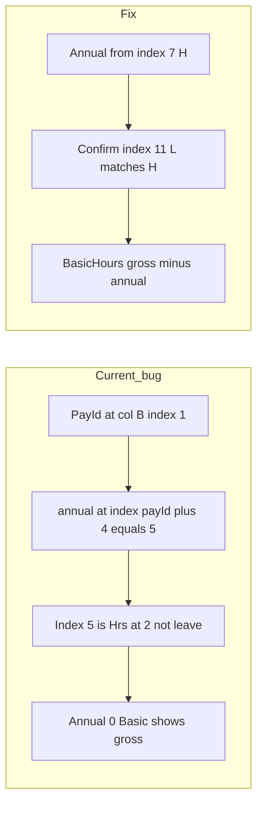

# Interpret HR’s complaint and fix plan (revised)

## What she is saying

- She can use the app after login.
- In the weekly output, **annual holiday / leave hours are not shown on their own** in the **Annual holiday** column.
- Instead, those hours **only show up under Basic**, as if Basic swallowed them.

She expects **two separate numbers**: **Basic** (worked / non-leave bucket) and **Annual holiday**, like payroll—not one lump in Basic.

## Does the H/L finding help?

**Yes.** It explains the bug and points to the fix.

- Today the Pay-ID path uses **`pay_id_col + 4`** for “annual”. With **Pay ID in column B** (index 1), that is **index 5** (Excel **F**) — in your ClockRite file that is **`Hrs @ 2`**, **not** annual. So **`annual_holiday` is almost always 0**.
- Then **`BasicHours = gross_basic − 0`**, so **everything that should be split into Annual stays in Basic** — exactly what HR describes.
- **Annual is actually present in Excel `H` and `L`** (0-based **7** and **11**). You report **both cells match** for a row; treat that as **one** annual figure (e.g. read **H**, optionally verify **L** equals **H** so we never double-count).

So: **HR’s complaint matches “parser reads the wrong column for annual.”** Mapping annual to **H/L** is the corrective rule; the **row-5 header words** are not how we decide (they can say “Hrs @ *” while payroll still treats **H/L** as the annual slot you care about).

## What the code does today (relevant bit)

In [`weekly/payroll_service.py`](weekly/payroll_service.py), Pay-ID path: gross basic from the column after Pay ID, “annual” from **fixed offset +4**, then `BasicHours = gross − annual`, `TotalPaidHours` unchanged. Preview in [`weekly/templates/weekly/weekly_report.html`](weekly/templates/weekly/weekly_report.html) just displays those fields—no merge bug downstream.

## What we should fix (implementation intent)

1. **Annual holiday source:** For this ClockRite **Paid Hours (Inc Absence) Summary** layout, set **`AnnualHoliday`** from **column H (index 7)**; if **column L (index 11)** is present, **require equality with H** when both numeric (or take the single non-zero) so we **never sum two copies** of the same holiday hours.
2. **Gross basic:** Keep the existing idea—**gross basic** from the right column(s) for this grid (still **Pay ID–relative or fixed column** as today for the “Sage / first payable” block), then **`BasicHours = gross_basic − AnnualHoliday`** so totals stay consistent.
3. **Mon–Fri / Sat–Sun bands:** The sheet uses **Hrs @ 1 … Hrs @ 5** between Sage and the absence block; if the app must match payroll OT splits, we may need to **re-map those columns** by position (not only by “+1,+2,+3” from Pay ID). Scope this when implementing so exported OT columns line up with [`weekly/payroll_service.py`](weekly/payroll_service.py) expectations.
4. **Legacy path / other exports:** Keep a **fallback** (current offsets or header scan) for older files if they still appear in production.
5. **Tests:** Fixture rows with **non-zero values in H (and matching L)**; assert **`AnnualHoliday`** equals that value and **`BasicHours`** is gross minus annual; run against `data/TEST_DATA` files once some rows have non-zero H/L.

## How to test after the change

- Employees with holiday in **H/L**: report shows **Annual holiday** filled, **Basic** reduced, **Total paid** unchanged vs your manual check from the file.
- Run full weekly flow on `data/TEST_DATA` (note: some snapshots may have **all zeros** in absence columns—that only proves “no leave that week,” not that parsing is wrong).

