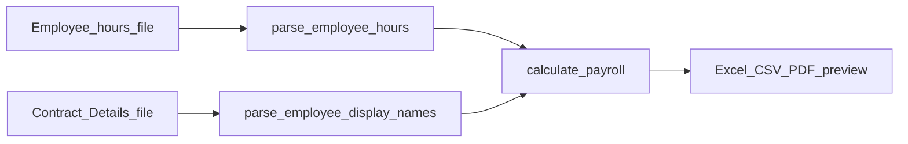

# Replace clock names with full names in weekly export

## Problem

The **employee hours** file ([`dgross_paysummary2`](data/ovettime_error_test_data/dgross_paysummary2%20(3).xls)) stores **clock names** in column A, e.g. `S PATEL EOLL`. The **contract** file ([`demployees_2023 (1).xls`](data/ovettime_error_test_data/demployees_2023%20(1).xls)) has both names per employee block:

| Row in block | Example |
|--------------|---------|
| Title row (col B) | `Sonal Patel EOLL` (full name) |
| `Clock Name` row | `S PATEL EOLL` |
| `Sage Pay Ref` | `1528` (matches Pay ID in hours file) |

Today [`parse_employee_hours`](weekly/payroll_service.py) sets `"Name": name_text.upper()` (line 196), so exports show clock-style names everywhere.

There is no Excel `VLOOKUP` in the Python app yet—the join should mirror that idea: **lookup full name from the contract file using Pay ID / Sage No**.



## Implementation

### 1. Parse display names from contract file

In [`weekly/payroll_service.py`](weekly/payroll_service.py), add:

- **`_block_names_near(rows, r_payroll) -> tuple[str, str]`** — walk up to 30 rows above a `Payroll Number` row:
  - **Full name:** first row where col A is a short numeric Prox ID and col B is not a label (same row used today for `by_name` contract matching at lines 319–329).
  - **Clock name:** row where a cell normalizes to `clockname`; value in the next column.

- **`_parse_clockrite_display_names(rows) -> tuple[dict[int, str], dict[str, str]]`**
  - For each `Payroll Number` / `Sage Pay Ref` block (reuse `_sage_pay_ref_ids_near` like contract hours):
    - `by_sage[payroll_no] = full_name`
    - `by_sage[sage_pay_ref] = full_name` for each alias ID
  - `by_clock[clock_name.upper()] = full_name` when both exist

- **`parse_employee_display_names(file_obj) -> tuple[dict[int, str], dict[str, str]]`**
  - Load sheet once; if a tabular header row exists (future/simple exports), optionally map `employeename` / `name` vs `clockname` columns if both present; **primary path** is `_parse_clockrite_display_names` (same file shape as contract hours).

### 2. Apply names during payroll calculation

In **`calculate_payroll`** (after contract hours join, ~line 386):

```python
contracted_file_obj.seek(0)
by_sage_name, by_clock_name = parse_employee_display_names(contracted_file_obj)

for row in employee_rows:
    full = by_sage_name.get(int(row["SageNo"])) or by_clock_name.get(str(row["Name"]).upper())
    if full:
        row["Name"] = full
```

- **Join order:** SageNo first (handles Sage Pay Ref ≠ Payroll Number, e.g. 1528), then clock name fallback.
- **If no match:** keep existing name (clock name) — no error.
- **Scope:** updates session rows → **All Data / Agency / Gazebo sheets, CSV, PDF, and HTML preview** (not only Excel).

Contract hours matching (`by_name`) is unchanged and still uses full-name keys from the title row; display-name replacement does not affect hour math.

### 3. Tests

In [`weekly/test_payroll_contract.py`](weekly/test_payroll_contract.py):

- **Synthetic block test** (openpyxl): one ClockRite block with full name `Sonal Patel EOLL`, clock `S PATEL EOLL`, Sage Pay Ref `1528`; assert `parse_employee_display_names` maps both keys.

- **Integration test** (skip unless fixture present): load [`data/ovettime_error_test_data/dgross_paysummary2 (3).xls`](data/ovettime_error_test_data/dgross_paysummary2%20(3).xls) + [`demployees_2023 (1).xls`](data/ovettime_error_test_data/demployees_2023%20(1).xls), run `calculate_payroll`, assert row with `SageNo == 1528` has `Name == "Sonal Patel EOLL"`.

## Manual check

1. Process the two files in `data/ovettime_error_test_data/`.
2. Download Excel — **Name** column should show `Sonal Patel EOLL` instead of `S PATEL EOLL` / `S Patel EOLL`.
3. Spot-check a few other employees where full name ≠ clock name in the contract file.

## Out of scope

- Changing [`parse_employee_hours`](weekly/payroll_service.py) to stop uppercasing (optional; display replace overrides for matched rows).
- Monthly report name replacement (different file layout; separate task if needed).
