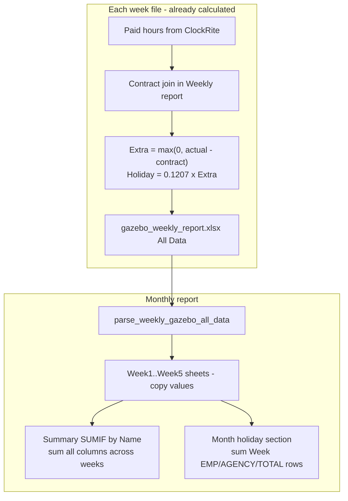

# How the monthly report calculates (and holiday pay)

## Short answer

**Yes — the monthly report is built by totalling the 4–5 weekly files.** It does **not** join to the contract file again. Each week file already contains that week’s **Actual hours**, **Contracted hours**, **Extra hours**, and **Additional holiday pay** (from the Weekly/Daily report). The monthly workbook:

1. Copies each week into its own sheet (`Week1` … `Week5`)
2. On **Summary**, uses Excel `SUMIF` by **employee name** to add each column across weeks
3. At the bottom, adds up each week’s EMP/AGENCY/TOTAL holiday-pay rows

So for money: **monthly extra/holiday = sum of weekly extra/holiday**, not a fresh month-level formula.

---

## Data flow



Key code paths:

- Parse weekly row: [`_monthly_employee_from_row`](weekly/monthly_service.py) reads columns from **All Data**, including contracted/extra/holiday if present
- Weekly formula (source of truth): [`compute_extra_holiday_pay`](weekly/payroll_service.py) — `extra = max(0, actual − contracted)`, `holiday = 0.1207 × extra`
- Summary cross-week sum: [`_xl_cross_week_sumif`](weekly/monthly_service.py) — `SUMIF(Week1!A:A, name) + SUMIF(Week2!A:A, name) + …` for **every** hour column (D–K), including Contracted, Extra, Holiday pay
- Month holiday totals: [`_write_holiday_pay_section_monthly_formulas`](weekly/monthly_service.py) — adds Week1..Week5 EMP/AGENCY/TOTAL holiday rows

---

## Your example: emp1 with changing contract hours

Assume emp1 worked the same actual hours each week for simplicity:

| Week | Contract (from weekly file) | Actual | Extra (weekly) | Holiday pay (weekly) |
|------|----------------------------|--------|----------------|----------------------|
| 1 | 20 | 40 | 20 | 20 × 0.1207 = **2.41** |
| 2 | 20 | 40 | 20 | **2.41** |
| 3 | 30 | 40 | 10 | **1.21** |
| 4 | 45 | 40 | 0 (under contract) | **0.00** |

### What Summary shows for emp1

| Column | How calculated | Value |
|--------|----------------|-------|
| Actual hours | 40+40+40+40 | **160** |
| Contracted hours | 20+20+30+45 | **115** (sum of weekly contracts, not “45”) |
| Extra hours | 20+20+10+0 | **50** |
| Additional holiday pay | 2.41+2.41+1.21+0 | **6.03** |

**Important:** Summary does **not** compute `Extra = 160 − 115 = 45`. It sums **each week’s extra** (50). That matches “total from each file” — which is what you expected.

In this example 50 also equals `160 − 115`, but that is **not always true** (see edge case below).

---

## How holiday pay works (step by step)

### Per week (in Weekly report, before monthly)

From [`compute_extra_holiday_pay`](weekly/payroll_service.py):

```
Extra hours        = max(0, Actual hours − Contracted hours)
Additional holiday = 0.1207 × Extra hours   (rounded to 2 decimals)
```

Each weekly export stores these per employee on **All Data**.

### Per week sheet in monthly workbook

Week sheet employee rows are **copied values** from the parsed weekly file ([`_write_employee_row`](weekly/monthly_service.py)). No new math.

Each week sheet also has an **Additional holiday pay** block (EMP / AGENCY / TOTAL) that **sums** extra and holiday columns from that week’s employee table using Excel formulas.

### Summary sheet

- **Employee table:** each cell = `SUMIF` across Week1–5 for that name and column → **totals extra and holiday from all weeks**
- **Month total — additional holiday pay:** adds the three weekly TOTAL rows (EMP+AGENCY+TOTAL per week, then summed across weeks)

So holiday pay at month level = **sum of weekly holiday pays**, not `0.1207 × (month extra)` unless those happen to match.

---

## What is summed vs what is NOT recalculated

| Item | Monthly behaviour |
|------|-------------------|
| Basic / OT / Annual / Actual hours | Sum across weeks |
| Contracted hours | **Sum** of each week’s contracted value |
| Extra hours | **Sum** of each week’s extra |
| Additional holiday pay | **Sum** of each week’s holiday pay |
| Contract file (demployees) | **Not used** in monthly |
| Weekly contract join logic | **Not run** again in monthly |

Legacy `.xls` week files (no contracted/extra/holiday columns) parse those as **0** — only use `.xlsx` weekly exports from the app for correct holiday totals.

---

## Edge case (when sum-of-weeks ≠ one big month formula)

If an employee is **under contract** some weeks and **over** in others:

| Week | Actual | Contract | Weekly extra |
|------|--------|----------|--------------|
| 1 | 15 | 20 | 0 |
| 2 | 25 | 20 | 5 |

- **Monthly (current):** extra = 0 + 5 = **5**, holiday = 0 + 0.60 = **0.60**
- **Hypothetical month formula:** total actual 40, total contract 40 → extra = **0**

The app intentionally uses **sum of weekly extras** (because each week file is the payroll unit). That is consistent with “just total from each file”, but different from recomputing once at month end.

---

## Is anything “wrong” for people’s money?

### Technically consistent (good)

- Monthly **does not** invent new joins or change weekly numbers
- Summary Excel formulas trace back to Week sheets (click a cell → see `SUMIF` to Week1…Week5)
- Hour bands (Basic, OT, etc.) are summed the same way
- Under-contract weeks correctly give **0 extra** for that week only

### Things to be aware of (business, not bugs)

1. **Contracted hours on Summary** is a **sum of weekly contracts** (20+30+45…), not “contract for the month”. Useful as a total baseline hours figure, but not “latest contract”.
2. **Holiday pay** is **sum of weekly holiday pays** — correct if payroll treats each week separately (matches your weekly report rules).
3. **Input quality:** monthly is only as good as each weekly export (contract hours, match status, etc.). Garbage in from Week 3 flows into Summary unchanged.
4. **Name matching:** Summary `SUMIF` matches on **Name** in column A. Names must be consistent across weeks (app enriches to full name in weekly report — keep using those exports).

---

## Where to verify in the Excel you download

1. Open **Week1** … **Week4/5** — check emp1’s Contracted / Extra / Holiday per week
2. Open **Summary** employee row — click **Extra hours** or **Additional holiday pay** — formula should be `SUMIF('Week1'!...) + SUMIF('Week2'!...) + ...`
3. Scroll to **Month total — additional holiday pay** — should reference each week’s TOTAL row

---

## If you want a different rule later

Only change monthly logic if HR confirms pay should be:

- **Option A (current):** sum weekly extras/holiday — “each week stands alone”
- **Option B:** one month calculation: `extra = max(0, month_actual − month_contract)` and `holiday = 0.1207 × that` (would need defining which single “month contract” means when it changes weekly)

No code change recommended unless HR picks Option B explicitly.
